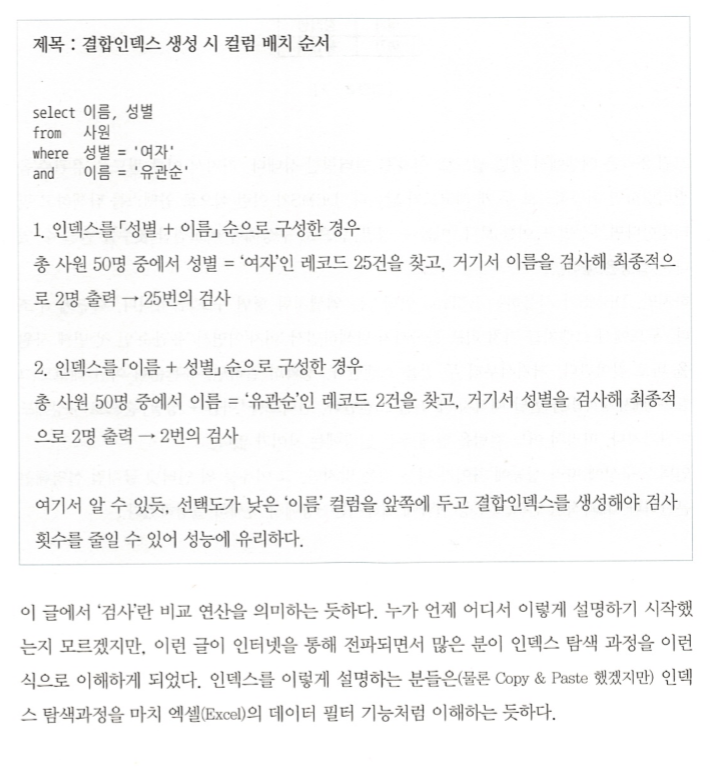
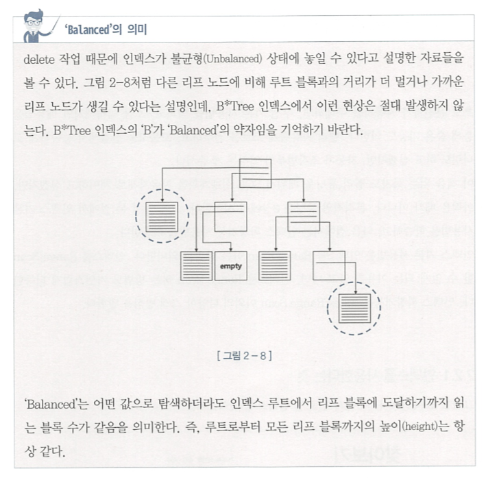

##2.1 : 인덱스 구조 및 탐색

- `LMC(Leftmost Child`

  - 자식 노드 중 가장 왼쪽 끝에 위치한 블록을 가리킨다.

- 인덱스 탐색 과정
  1. 수직적 탐색 : 인덱스 스캔 시작지점을 찾는 과정
  2. 수평적 탐색 : 데이터를 찾는 과정

1. 수직적 탐색
   수직적 탐색은 `조건을 만족하는 레코드`를 찾는 과정이 아니라 `조건을 만족하는 첫번째 레코드`를 찾는 과정이다.
   브랜치 블록에서 해당 값을 찾았다고 바로 이동을 하면, 직전 레코드의 블록 마지막에 저장되어 있을 수도 있는 데이터를 놓칠 수 있다.

2) 수평적 탐색

- 인덱스 리프 블록끼리는 서로 앞뒤 블록에 대한 주소값을 갖는다. 즉, 양방향 연결 리스트 구조이다.
- 인덱스를 `고객명 + 성별`로 구성하든, `성별 + 고객명`으로 구성하든 읽는 인덱스 블록 개수는 똑같다. 블록 I/O 개수가 같으므로 성능도 똑같다.  
  하단은 잘못된 내용의 글이다.

- **인덱스는 엑셀의 데이터 필터기능 같지 않다. DBMS가 사용하는 B\*Tree 인덱스는 엑셀처럼 평면 구조가 아니다.**

**[실제 찾아가는 방식]**

1. 다단계 구조로 루트에서 브랜치를 거쳐 리프블록까지 탐색하면서 `여자`이면서 `유관순`인 첫 번째 사원을 바로 찾아간다.
2. 거기서 부터 두 건을 스캔한다. 정확히 말하면, 유관순이 아닌 레코드를 만날때까지 세 건을 스캔한다.
3. 인덱스를 `이름 + 성별`순으로 구성해도 마찬가지다.

