##2.2 : 인덱스 기본 사용법

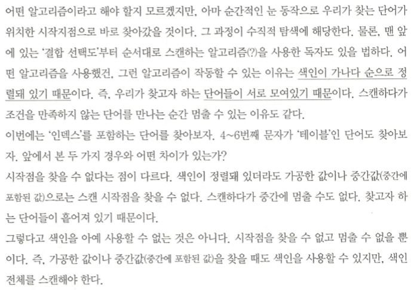

- 인덱스 컬럼을 가공하면 인덱스를 정상적으로 사용할 수 없다.

  - 스캔 시작지점과 종료 지점을 알 수 없기 때문.
  - 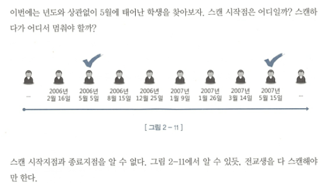
  - `where substr(생년월일, 5, 2) = '05'` 절이나, `where nvl(주문수량,0) < 100`, `where 업체명 like '%대한%'` 외에도 OR 조건도 불가능하다.
  - 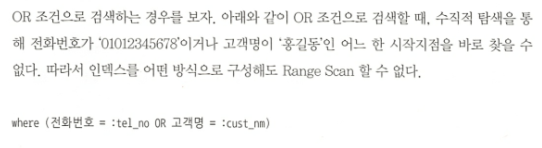

  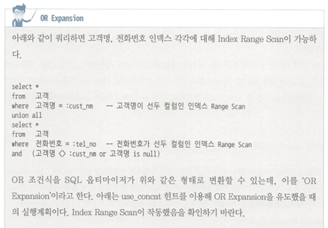
  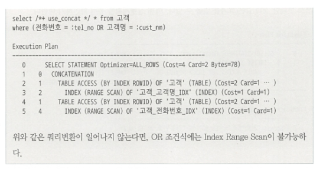

  - `where 전화번호 in ( :tel_no1, :tel_no2 )`의 IN 조건은 OR 조건을 표현하는 다른 방식일 뿐이기 때문에 인덱스 탐색이 불가능하다.  
    대신 IN 조건절에 대해서는 SQL 옵티마이저가 `IN-List Iterator`방식을 사용하여 IN-List 개수만큼 Index Range Scan을 반복하여 SQL을 UNION ALL로 변환한 것과 같은 효과를 얻을 수 있다. 하단은 해당 실행계획이다.
    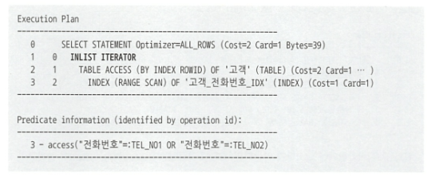

#### 정리

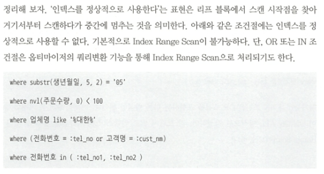

### 인덱스 사용 조건

- 인덱스 선두 컬럼이 조건 절에 있어야 한다.

**But**
하루에 주문이 100만건이 들어온다.
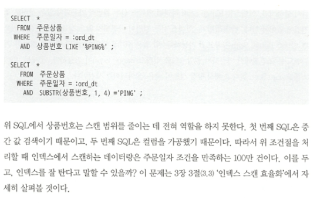
이 경우 인덱스를 타지만 상품번호는 전혀 역할을 하지 못한다. 결국 해당 주문일자를 만족하는 100만건을 모두 스캔해야 한다는 것.

- 인덱스를 `Range Scan`할 수 있는 이유는 데이터가 정렬되어있기 때문이다.

### ORDER BY 절에서 컬럼 가공

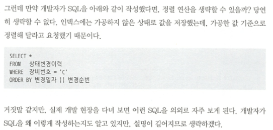

※ 참고
`TO_CHAR(A.주문번호, 'FM000000') AS 주문번호`  
 → 해당 주문번호 숫자값을 0으로 시작하는 여섯자리 문자값으로 변환해 준다. 예를 들어 숫자 `1234`를 입력하면, 문자 `001234`로 변환해준다.

### 자동 형변환

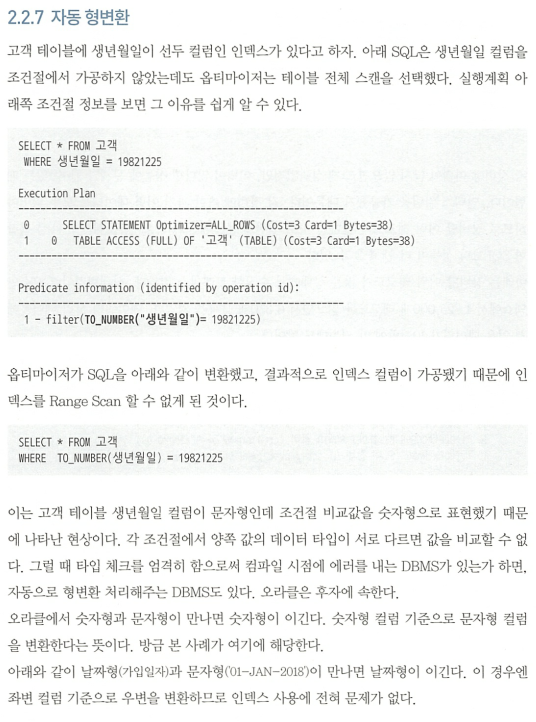

1. 오라클에서는 `숫자형`과 `문자형`이 만나면 `숫자형이 이긴다.`
2. `날짜형`과 `문자형`이 만나면 `날짜형이 이긴다.`

**But..**
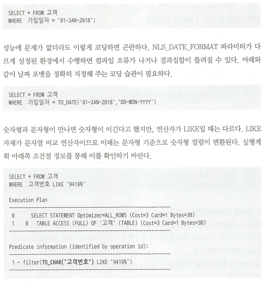

- 자동 형변환 결과 오류 예시
- 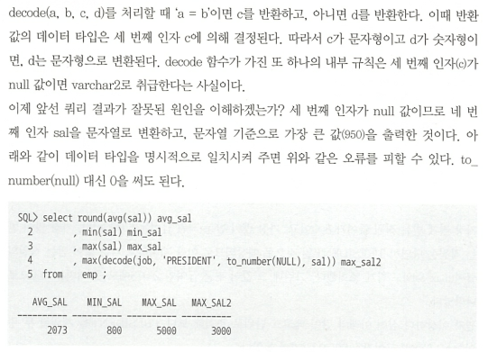

