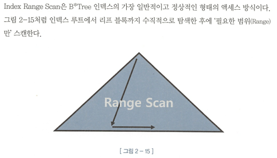
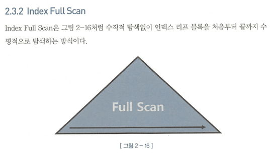
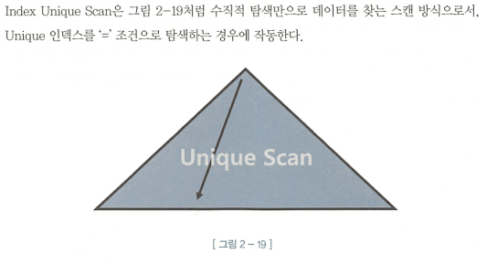
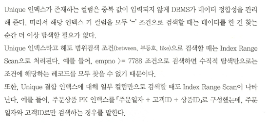
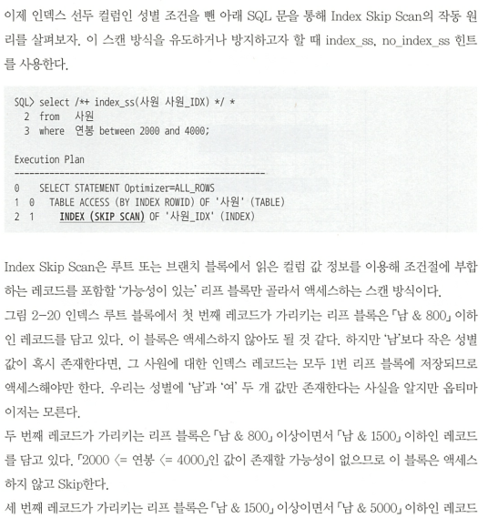
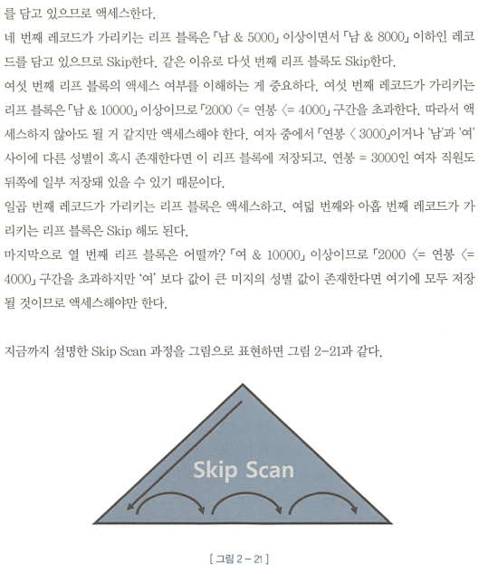
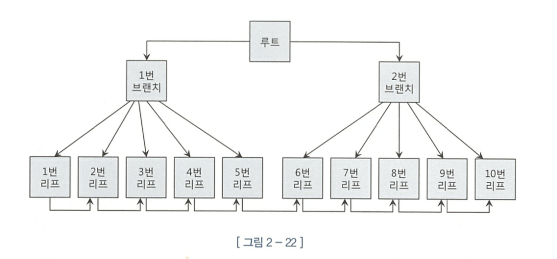
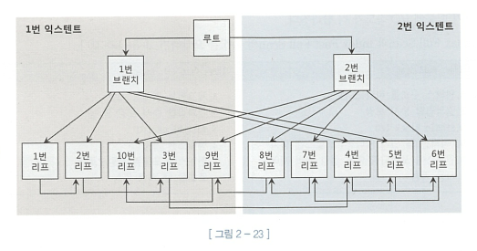
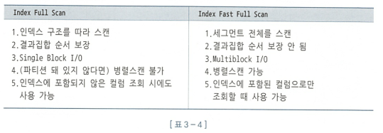
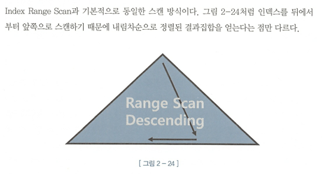

#2.3 : 인덱스 확장기능 사용법

### Index Range Scan

### Index Full Scan

- 인덱스 선두컬럼이 없을 경우, Range 스캔 불가.

### Index Unique Scan

### Index Skip Scan

- 인덱스 선두 컬럼을 조건절에 사용하지 않으면 옵티마이저는 기본적으로 Table Full Scan을 선택.
  (TFS 보다 I/O를 줄일 수 있거나 결과를 쉽게 얻을 수 있다면 Index Full Scan을 사용하기도 함)

- 해당 방식은 오라클이 인덱스 선두 컬럼이 조건절에 없어도 인덱스를 활용하는 새로운 스캔 방식을 9i 버전에서 만든 방식이다.

**이 스캔 방식은 조건절에 빠진 인덱스 선두 컬럼의 Distinct Value 개수가 적고 후행 컬럼의 Distinct Value 개수가 많을 때 유용**
(ex. 고객 테이블에서 Distinct Value 개수가 가장 적은 컬럼은 '성별' 이며, Distinct Value 개수가 가장 많은 컬럼은 '고객번호'이다.)

- `루트` 또는 `브랜치 블록`에서 읽은 컬럼 값 정보를 이용해 조건절에 부합하는 레코드를 포함할 `가능성이 있는` 리프 블록만 골라서 액세스 하는 스캔 방식 (p.118)

#### 인덱스 선두 컬럼이 없을때만 작동하는것은 아니다.

### Index Fast Full Scan

- Index Fast Full Scan이 Index Full Scan보다 빠른 이유는 논리적인 인덱스 트리 구조를 무시하고 인덱스 세그먼트 전체를 Multiblock I/O 방식으로 스캔하기 때문이다.

##### 예시

- 인덱스의 논리적 연결구조
  

- 인덱스의 물리적 연결구조
  

`Index Full Scan` : 논리적 구조를 따라 루트 → 브랜치1 → 1 → 2 →3 → 4 → ... 9 → 10 순으로 읽는다.

`Index Fast Full Scan` : 물리적으로 저장된 순서에 따라 `Multiblock I/O 방식`으로 제일 왼쪽 익스텐트에서 1 → 2 → 10 → 3 → 9 순으로 읽고, 오른쪽 익스텐트에서 8 → 7 → 4 → 5 → 6 순으로 읽는다.
(루트와 브랜치 블록도 읽지만 필요없으므로 버린다)

### Index Range Scan Descending

