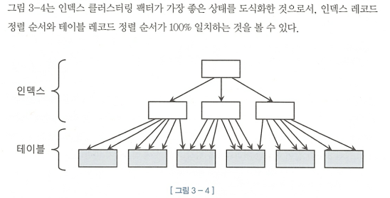
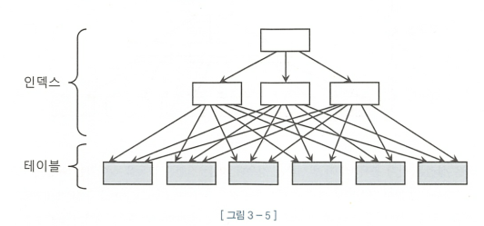
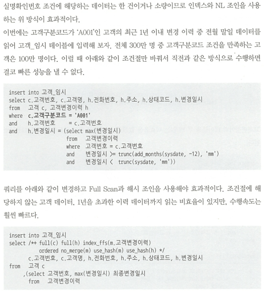
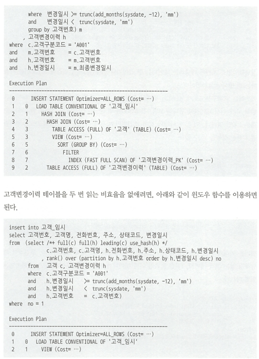
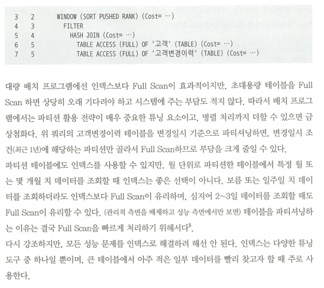
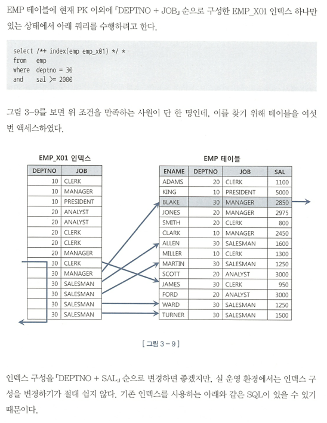
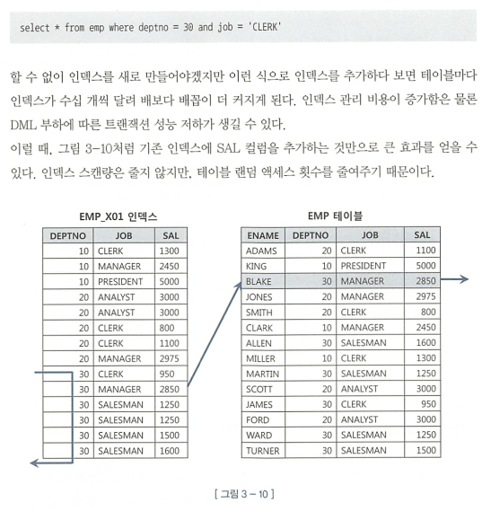
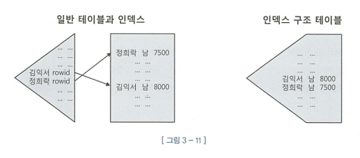
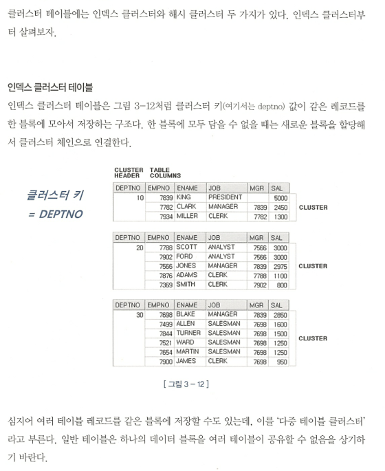
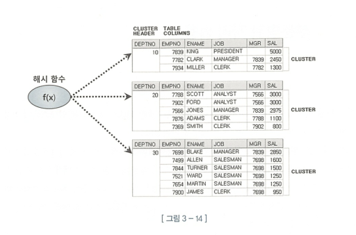

##3.1 : 테이블 액세스 최소화

### 테이블 랜덤 액세스

##### 인덱스 ROWID는 물리적 주소일까? 논리적 주소일까?

- 구성요소 : 데이터파일 번호, 오브젝트 번호, 블록 번호 등.

- **각각 물리적으로 직접 연결된 물리적 주소들이 모여서 만들어진 논리적 주소에 가깝다.**

##### 메인 메모리 DB와 비교

- 어떤 메인 메모리 DB의 경우, 인스턴스를 기동하면 디스크에 저장되어있는 데이터를 버퍼캐시로 로딩하고 인덱스를 생성한다. 이때 인덱스는 오라클처럼 디스크상의 주소정보를 갖는것이 아니고 메모리상의 주소정보, 즉 포인터를 가져 비용이 굉장히 낮다.

- 즉 오라클은 테이블 블록이 수시로 버퍼캐시에서 밀려났다가 다시 캐싱되며, 그때마다 다른 공간에 캐싱되기 때문에 포인터로 직접 연결 X  
  하여 메모리 주소정보(포인터)가 아닌 디스크 주소정보(DBA[^dba])를 이용해 해시 알고리즘으로 버퍼 블록을 찾아간다.

### 3.1.2 인덱스 클러스터링 팩터

- 클러스터링 팩터(이하 'CF')는 '군집성 계수' 정도로 번역할 수 있으며, 특정 컬럼을 기준으로 같은 값을 갖는 데이터가 서로 모여있는 정도를 의미

- CF가 좋은 상태
  

- CF가 나쁜상태
  

### 3.1.3 인덱스 손익분기점

- ROWID를 이용한 테이블 액세스는 생각보다 고비용 구조다. 따라서 읽어야 할 데이터가 일정량을 넘는 순간, 테이블 전체를 스캔하는 것 보다 오히려 느려지는 그 지점을 `인덱스 손익분기점`이라고 한다.

- **인덱스를이용한 테이블 엑세스가 테이블 풀스캔보다 느려지게 만드는 요인 2개**
  1. `Table Full Scan`은 시퀀셜 액세스지만, 인덱스 ROWID를 이용한 테이블 액세스는 랜덤 액세스 방식
  2. `Table Full Scan`은 Multiblock I/O지만, ROWID를 이용한 테이블 액세스는 Single Block I/O 방식

#### 온라인 프로그램 튜닝 vs 배치 프로그램 튜닝 (무조건 다시 읽어볼 것. 현재는 어렵다.) - p.142

- 온라인 프로그램

  - 보통 소량 대이터를 읽고 갱신하므로 인덱스를 효과적으로 활용하는 것이 중요
  - 대부분 NL조인(인덱스를 이용하는 조인방식)을 사용
  - 인덱스를 이용해 소트연산을 생략함으로써 부붐범위 처리 방식으로 구현할 수 있으면 온라인에서 대량데이터 조회시 아주 빠른 응답속도 낼 수 있다.

- 배치 프로그램

  - 항상 전체범위 처리 기준으로 튜닝해야 한다. 즉 처리대상 집합 중 일부를 빠르게 처리하는 것이 아니라 전체를 빠르게 처리하는것을 목표로 해야한다.
  - 즉 인덱스와 NL조인보다 Full Scan과 해시조인이 유리하다.

### 3.1.4 인덱스 컬럼 추가

- 가장 일반적으로 사용하는 튜닝 기법

- 기존 인덱스에 새로운 컬럼을 추가하는 것만으로 랜덤 액세스 횟수를 줄여주어 큰 효과를 얻을 수 있다.

### 3.1.5 인덱스만 읽고 처리

- 랜덤 액세스가 아무리 많아도 필터 조건에 의해 버려지는 레코드가 거의 없다면 그건 비효율적인게 아니다. 비효율이 없더라도 얻은 데이터가 많다면 랜덤 액세스가 당연히 많이 발생하므로 성능이 느릴 수 밖에 없다.

- 여기서 반드시 성능 개선이 필요하다면 쿼리에 사용된 모든 컬럼을 모두 인덱스에 추가해서 테이블 액세스가 아예 발생하지 않는 방법이 있다. 해당 쿼리를 `Covered 쿼리` 라고 하며 그 쿼리에 사용한 인덱스를 `Covered 인덱스`라고 부른다.

### 3.1.6 인덱스 구조 테이블

- 랜덤 액세스가 아예 발생하지 않도록 테이블을 인덱스 구조로 생성하는 방법을 오라클에서는 `IOT(Index-Organized Table)`이라고 부른다.

- 테이블을 찾아가기 위해 ROWID를 갖는 일반 인덱스와 달리 IOT는 테이블 블록에 있어야 할 데이터를 리프 블록에 모두 저장하고 있다. `즉, 인덱스 리프블록이 곧 데이터 블록`이다.
  

- 일반 테이블은 힙 구조인데, 데이터를 입력할 때는 랜덤 방식을 사용한다. 즉, Freelist로부터 할당 받은 블록에 정해진 순서없이 데이터를 입력한다. 반면 IOT는 인덱스 구조 테이블이므로 `정렬 상태를 유지하며 데이터를 입력`한다.

### 3.1.7 클러스터 테이블

- 인덱스 클러스터 테이블
  

- 해시 클러스터 테이블
  
  

[^dba]: Data Block Address를 뜻하며, `데이터파일번호 + 블록번호`로 이루어져 있다.
