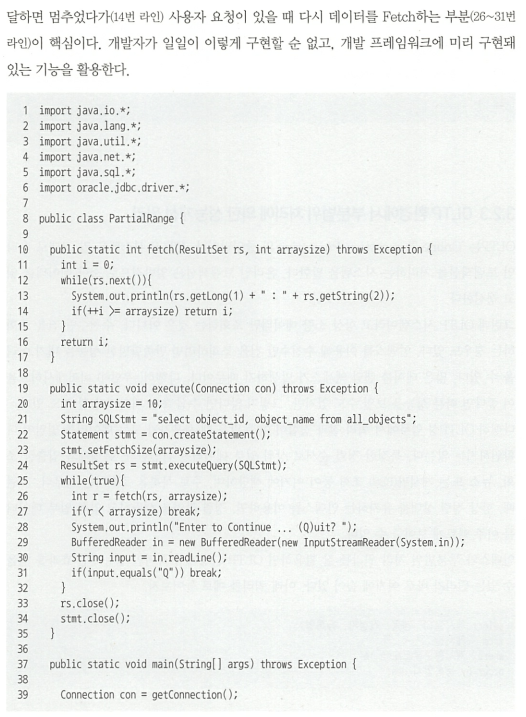
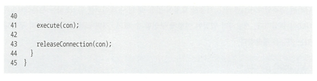

##3.2 : 부분범위 처리 활용

- 테이블 랜덤 액세스로 인한 인덱스 손익분기점의 한계를 그복할 히든카드

### 3.2.1 부분범위 처리

- **전체 쿼리 결과집합을 쉼 없이 연속적으로 전송하지 않고 사용자로부터 Fetch Call이 있을때마다 일정량씩 나누어 전송하는 것을 이른바 `부분범위 처리`라고 한다.**

- Array Size가 10인 상태에서 위 JAVA 프로그램이 데이터를 읽어들이는 메커니즘
  1. 최초 rs.next()호출 시 Fetch Call을 통해 DB 통해 받은 데이터 10건을 클라이언트 캐시에 저장
  2. 이후 rs.next() 호출할 때는 캐시 내 데이터 읽음
  3. 캐시 내 데이터 다 읽은 상태에서 rs.next() 호출시 추가 Fetch Call을 통해 10건 전송받음
  4. 100건을 다 읽을때까지 2~3번 과정 반복
  5. 100건 읽고(10번의 Fetch Call 발생) 곧바로 ResultSet과 Statement 객체 닫아서 끝.

_(페이징 기법과 유사하다고 보면 된다.)_

- 모든 DBMS는 데이터를 조금씩 나눠서 전송한다. `중간에 멈췄다가 사용자의 추가 요청이 있을 때마다 데이터를 가져오도록 구현 하는것은 개발자의 몫`

### 3.2.2 부분범위 처리 구현

**부분범위 처리는 `앞쪽 일부만 출력하고 멈출수 있는가`가 핵심이다. 멈출 수 있어야 의미가 있다.**
