##3.3 : 인덱스 스캔 효율화

### 3.3.2 인덱스 스캔 효율성

- 좌측 : `성능검`으로 시작하는 용어를 검색할때 스캔범위
- 우측 : `성능`으로 시작하고 네번째 문자가 `선`인 용어 검색할때 스캔범위

1. 일반 인덱스
   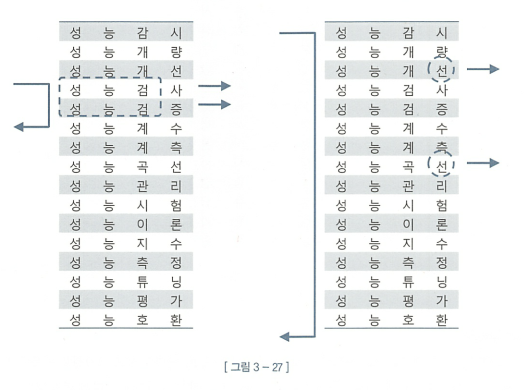

2. 각 글자를 인덱스
   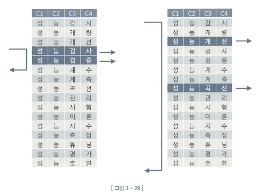

후자가 더 성능이 좋을것이라 생각했지만, 똑같았다.

**Why?**
인덱스 선행 컬럼이 조건절에 없기 때문

`인덱스 선행 컬럼이 조건절에 없거나 '=' 조건이 아니면 인덱스 스캔 과정에 비효율 발생`

##### 인덱스 스캔 효율성 측정

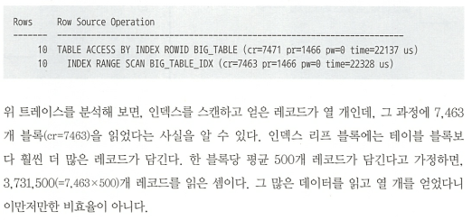

### 3.3.3 액세스 조건과 필터 조건

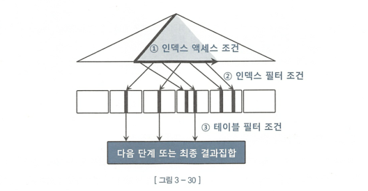

1. 인덱스 액세스 조건 (1번)
   인덱스 스캔 범위를 결정하는 조건절

2. 인덱스 필터 조건 (2번)
   테이블로 액세스 할지를 결정하는 조건절

앞선 `그림 3-29` 로 설명하면, 왼쪽 인덱스는 `C1,C2,C3가 모두 인덱스 액세스 조건`이었으며, 오른쪽 인덱스에서는 `C1, C2가 인덱스 액세스 조건`이고 `C4는 인덱스 필터조건`이었다.

3. 테이블 필터 조건 (3번)
   쿼리 수행 다음 단계로 전달하거나 최종 결과집합에 포함할지를 결정

#### 옵티마이저의 비용 계산 원리

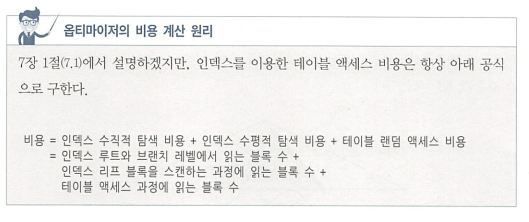

### 3.3.4 비교 연산자 종류와 컬럼 순서에 따른 군집성

**규칙**

선행 컬럼이 모두 `=` 조건인 상태에서 첫번째 나타나는 범위 검색 조건까지만 만족하는 인덱스 레코드는 모두 연속해서 모여있지만, 그 이하 조건까지 만족하는 레코드는 비교 연산자 종류에 상관없이 흩어진다.

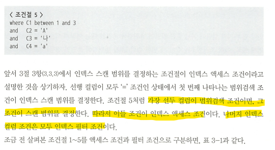
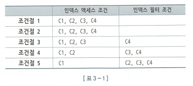

### 3.3.5 인덱스 선행 컬럼이 등치(=) 조건이 아닐때 생기는 비효율

- 인덱스 선행 컬럼이 조건절에 없거나 부등호, BETWEEN, LIKE 같은 범위검색 조건이면 인덱스를 스캔하는 단계에서 비효율이 생긴다.

### 3.3.6 BETWEEN을 IN-List로 전환

- 앞에서 나온 인터넷 매물 예시(p.193)에서 BETWEEN 조건을 IN-List로 바꿔주면 큰 효과를 얻는 경우가 있다.

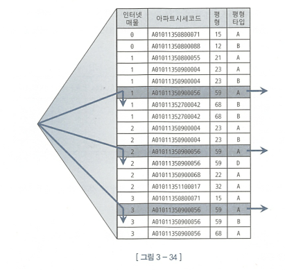

- 이때의 실행 계획
  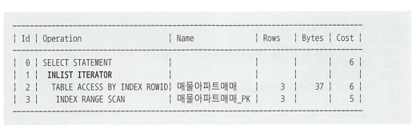

- 실제 오라클이 변환해준 쿼리
  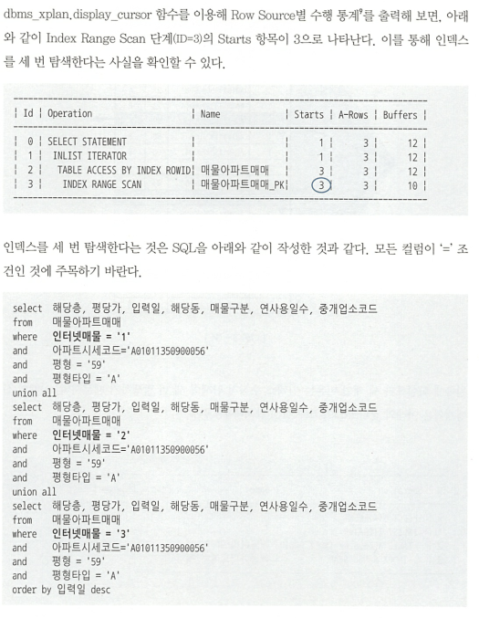

- 실제 인덱스 스캔과정
  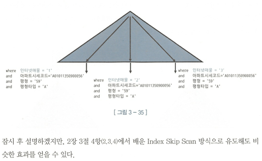

- 주의사항

1. 개수가 많지 않아야 적합하다.
   
   많을경우 우측처럼 수직적 탐색이 많이 발생하여, 리프블록을 많이 스캔하는 비효율보다 브랜치 블록을 반복 탐색하는 비효율이 더 클 수 있다.(특히 루트에서 브랜치까지 Depth가 깊을때)

2. 인덱스 스캔 과정에 선택되는 레코드들이 서로 멀리 떨어져 있을 때만 유용하다

### 3.3.7 Index Skip Scan 활용

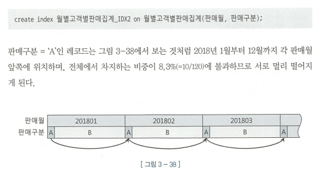
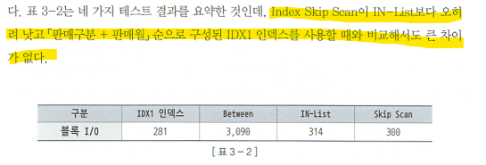

### 3.3.8 IN 조건은 '=' 인가

- IN 조건은 '='이 아니다. 인덱스의 조건에 따라 수행 효과가 달라진다.

- `IN-List Iterator` 방식으로 효과적인것은 각 레코드가 서로 멀리 떨어져 있을 때이다.

### 3.3.9 BETWEEN과 LIKE 스캔 범위 비교

- LIKE 보다 BETWEEN이 낫다.

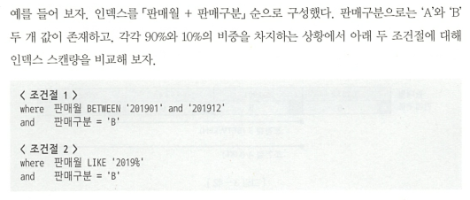
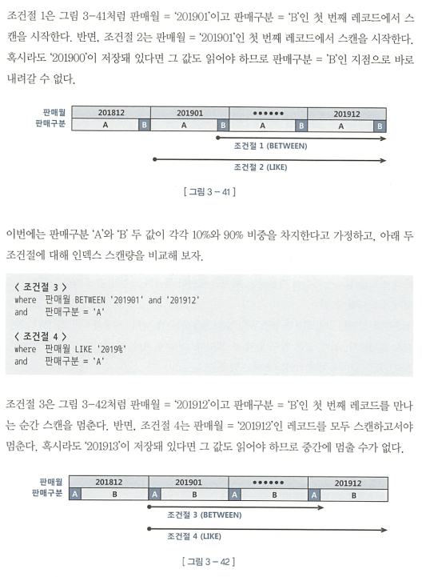

### 3.3.10 범위조건 검색을 남용할 때 생기는 비효율

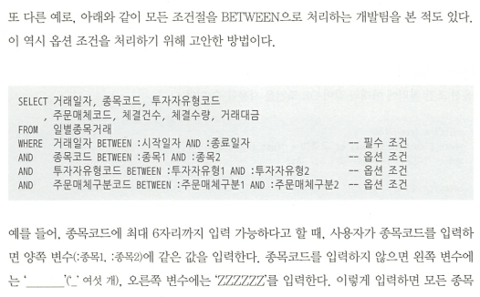

### 3.3.11 다양한 옵션 조건 처리 방식의 장단점 비교

##### OR 조건 활용

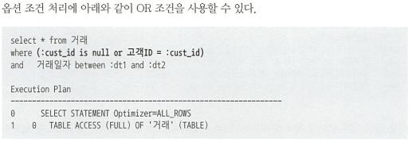

- 문제점
  옵션 조건 컬럼을 선두에 두고 `고객 ID + 거래일자` 순으로 인덱스를 구성해도 사용할 수 없다. **`인덱스 선두 컬럼에 대한 옵션조건에 OR 조건을 사용해선 안된다.`**

- 인덱스에 포함되지 않은 컬럼 옵션 조건은 어차피 테이블에서 필터링할 수 밖에 없으므로 OR 조건을 사용해도 무방.

- 정리
  1. 인덱스 액세스 조건으로 사용 불가
  2. 인덱스 필터 조건으로도 사용 불가
  3. 테이블 필터 조건으로만 사용 가능
  4. ~~OR 조건을 이용한 옵션 조건 처리는 가급적 사용하지 말자~~

**유일한 장점은 옵션 조건 컬럼이 NULL 허용 컬럼이어도 사용할 수 있다는것 뿐이다**

##### LIKE/BETWEEN 조건 활용

- 필수 조건 컬럼을 인덱스 선두에 두고 액세스 조건으로 사용하면 좋은 성능을 내지만, 필수 조건의 변별력이 좋지 않을때는 성능에 문제가 생김.

- **LIKE/BETWEEN 패턴 사용시 점검** (BETWEEN은 1,2만)
  1. 인덱스 선두 컬럼
  2. NULL 허용 컬럼
  3. 숫자형 컬럼
  4. 가변 길이 컬럼

1. 인덱스 선두 컬럼에 대한 옵션 조건을 LIKE?BETWEEN 연산자로 처리하는 것은 금물

2. NULL 허용 컬럼에 대한 옵션 조건을 LIKE/BETWEEN 연산자로 처리하는 것도 금물

   - LIKE/BETWEEN은 내부 데이터 값이 NULL일 경우 검색 집합에서 제외되기 때문

3. 숫자형이면서 인덱스 액세스 조건으로도 사용 가능한 컬럼에 대한 옵션 조건 처리에 사용 불가 (LIKE)

4. 컬럼값 길이가 고정적이어야 한다. (LIKE)

##### UNION ALL 활용

- `:cust_id` 변수에 값을 입력하든 안하든 인덱스를 가장 최적으로 사용한다. 대신 SQL 코딩량이 길어진다.

##### NVL,DECODE 활용

- NVL 활용
  

- DECODE 활용
  

둘 중 어느것을 사용하든 실행계획은 똑같다.
**하지만 `NVL`대신 `COALESCE`, `DECODE` 대신 `CASE`문을 사용해도 될 것 같지만 후자를 사용하면 `OR Expansion`이 작동하지 않는다.**
→ 왜일까?? 알아볼것

- 고객 ID 컬럼을 함수인자로 사용(인덱스 컬럼 가공) 했는데도 인덱스를 사용할 수 있는 것은 `OR Expansion 쿼리변환`[^orexpansion]이 일어났기 때문 (UNION ALL 방식으로 옵티마이저가 자동 쿼리 변환)

[^orexpansion]: NVL, DECODE 함수에 대한 OR Expansion을 가능하게 하는 히든 파라미터는 `_or_expand_nvl_predicate`이다.

- **장점**

  1. 옵션 조건 컬럼을 인덱스 액세스 조건으로 사용할 수 있다. 즉 `UNION ALL`보다 단순하면서도 같은 성능을 낸다.

- **단점**
  1. NULL 허용 컬럼에 사용할 수 없다.
  2. 옵션 조건 처리용 NVL/DECODE 함수를 여러개 사용하면 그 중 변별력이 가장 좋은 컬럼 기준으로 한번만 `OR Expansion`이 일어난다. (한번 빼고는 모두 필터 조건으로 처리된다)

**Dynamic SQL**

현재 마이바티스 등의 Dynamic SQL을 이용해 조건절을 동적으로 구성할 수 있는 시스템 환경에서 개발하고 있다면 해당 내용에 공감하지 못할 수 있다.

하지만 금융권에서는 Dynamic SQL을 쓰지 못하는 곳도 있다.

Dynamic SQL을 이용하더라도 하드 파싱에 의한 성능 문제가 발생하지 않도록 바인드 변수를 잘 사용하길. 조건절을 동적으로 구성한다고 해서 입력 값까지 동적으로 변경할 이유는 없다. (1.2.2 '바인드 변수의 중요성' 참조)

##### PL/SQL 함수의 성능적 특성

- PL/SQL 사용자 정의 함수가 느린 이유
  1. 가상머신(VM) 상에서 실행되는 인터프리터 언어
  2. 호출 시마다 컨텍스트 스위칭 발생
  3. 내장 SQL에 대한 Recursive Call 발생

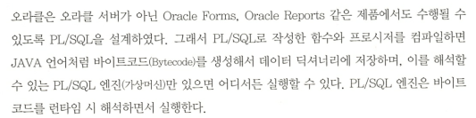

#### 잠깐! 복습!

1. 인덱스 액세스
   → 해당 조건 컬럼이 인덱스에 저장되어 있을 경우
2. 인덱스 필터
   → 해당 조건 컬럼이 인덱스에 저장되어 있고 인덱스 선행 조건 컬럼 중 한 개가 생략 되었을 경우
3. 테이블 액세스
   → 인덱스에 해당 조건 컬럼이 없을 경우

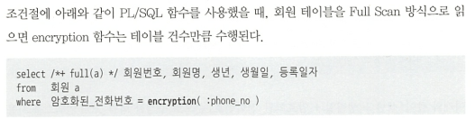

