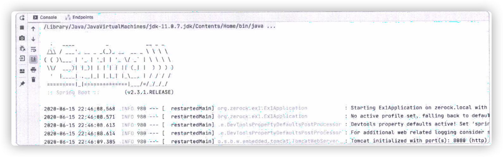
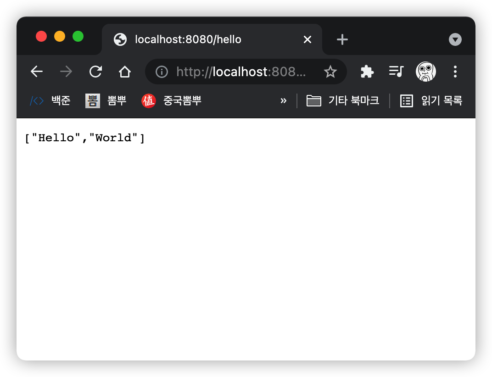
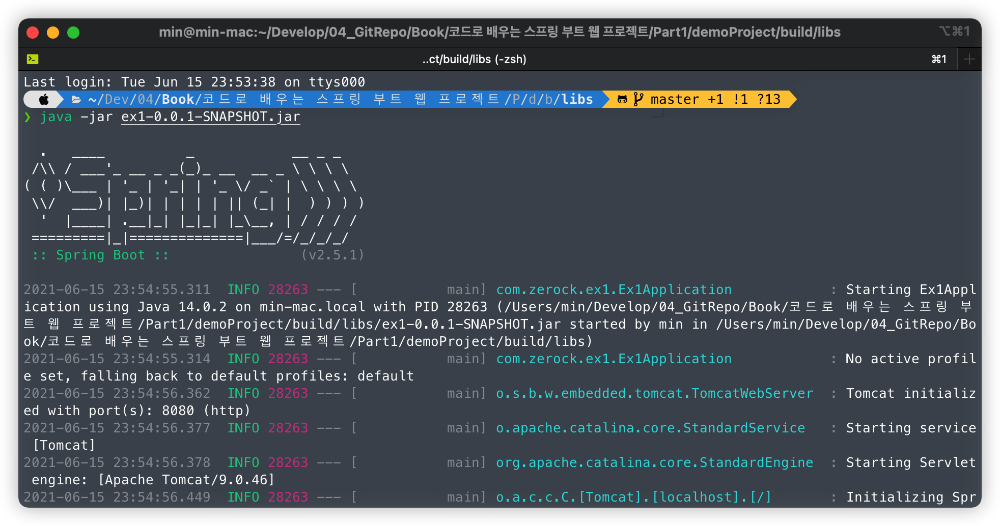

# 01. 프로젝트를 위한 준비

스프링 프레임워크는 2000년대 이후로 가장 확실하게 성공한 경량(?) 프레임워크이다.

스프링 부트는 스프링 프레임워크를 이용해서 더 간단하고 빠르게 개발할 수 있는 도구이다. **최소한의 설정만으로도 개발이 가능**하고, **자체적으로 내장되어 있는 `Tomcat`을 이용해서 별도의 설정 없이 서버를 실행해서 동작**시키는 것도 가능하다.



- `main()` 메서드를 이용하여 실행할 수 있으며, 기본적으로 8080포트를 사용한다. 배너의 경우 별도의 `banner.txt` 파일을 작성하면 변경도 가능하다.

## 테스트 환경에서 Lombok 활용하기.

`Lombok`을 테스트 환경에서도 이용하고 싶다면 `build.gradle`의 설정에 `testxxxx`로 시작하는 설정을 추가해야 한다.

```groovy
dependencies {
   ...생략...
      testCompileOnly 'org.projectlombok:lombok'
      testAnnotationProcessor 'org.projectlombok:lombok'
}
```

## 1.3 컨트롤러 만들기

스프링으로 컨트롤러를 사용하기 위해선 많은 설정이 필요하지만, 스프링 부트는 자동으로 설정되는 부분이 많다.

예를 들어 json타입의 데이터를 생성하기 위해서는 `Jackson-databind`와 같은 라이브러리가 필요한데 스프링 부트 프로젝트는 `Spring Web` 의존성 항목을 추가하는 경우에 자동으로 추가되므로 별도의 설정이 필요하지 않다.

```java
package com.zerock.ex1.controller;

import org.springframework.web.bind.annotation.GetMapping;
import org.springframework.web.bind.annotation.RestController;

// 별도의 화면 없이 데이터를 전송할 수 있음
@RestController
public class SampleController {

    // 브라우저의 주소창에서 호출이 가능하도록 설정
    @GetMapping("/hello")
    public String[] hello() {
        return new String[]{"Hello", "World"};
    }
}

```



## 1.4 스프링 부트를 단독으로 실행 가능한 파일로 만들기

기존 스프링은 프로젝트를 실행하기 위해서는 `Tomcat`과 같은 별도의 `WAS`가 반드시 필요하고 이를 배포하는 과정이 수반되었으나, 스프링 부트에서는 단독으로 실행가능한 웹 애플리케이션을 `jar` 파일의 형태로 제작하고 사용하는 것이 가능.

### Intellij gradle을 통한 build

1. 인텔리제이 우측의 `gradle -> Tasks -> build -> bootJar`을 선택하고 실행.
2. 프로젝트 내의 `build`폴더에 `프로젝트의 이름+0.01-SNAPSHOT.jar`와 같은 형태로 생성됨.

### jar 파일 실행



해당 jar파일을 터미널 환경을 이용하여 `java -jar 프로젝트의 이름+0.01-SNAPSHOT.jar`와 같이 해당 파일을 실행하면 서버 구동처리가 된다.

