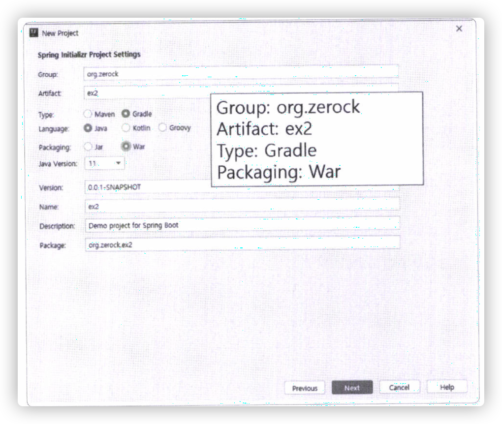
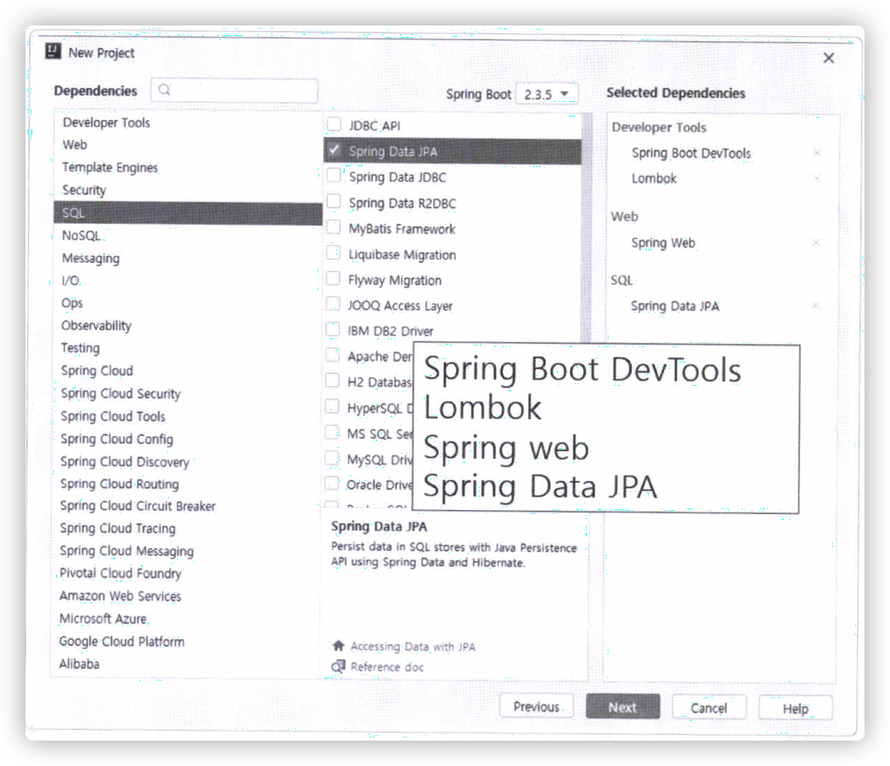
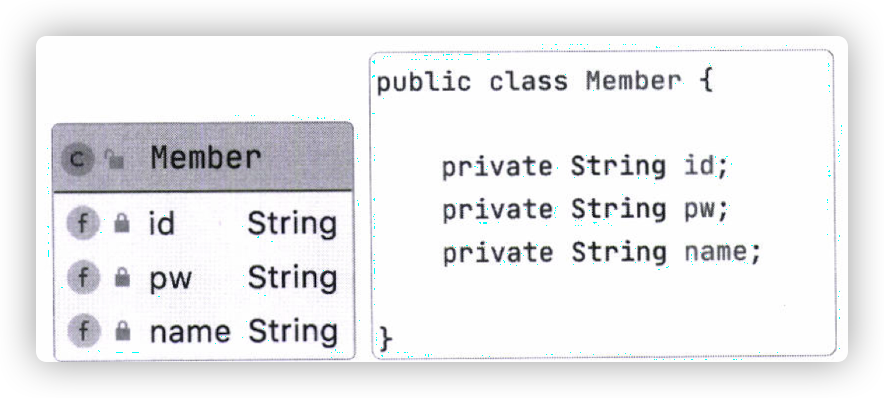
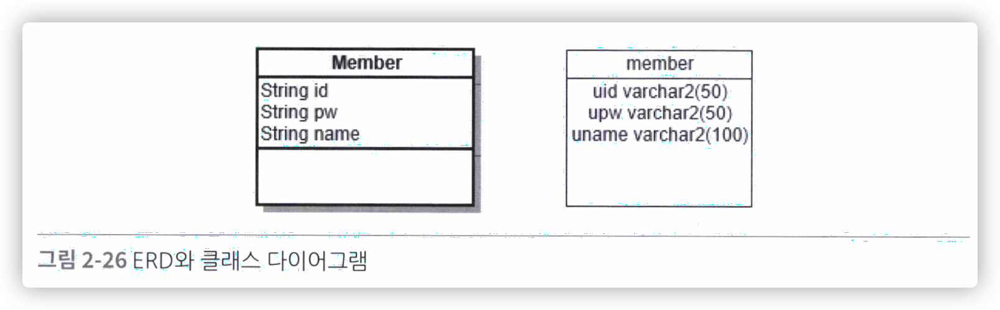
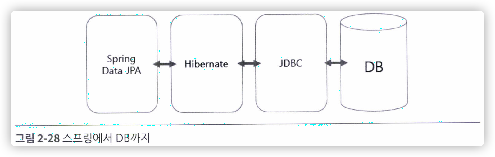

# 02.Maria 데이터베이스와 Spring Data JPA

## 2.1 MariaDB의 설치와 데이터 베이스 생성

`MariaDB`의 최대 장점은 `MySQL`과 거의 동일한 기능을 제공하면서도 완전한 오픈소스라는 것이다.

### 1. MariaDB 설치

책 내에서는 컴퓨터 자체에 `MariaDB`를 깔아 처리를 하고 있으나, 본인은 `Docker`를 통해 설치하였다. 또한 책 내에서는 `Heidi SQL`를 사용하나 본인은 인텔리제이 내의 `DataGrip`을 사용하여 처리하였다.

해당 방법은 아래 링크를 참고.

[도커로 MariaDB 환경 만들기](https://logical-code.tistory.com/122)

이후에 `bootuser` 라는 계정을 만든다.

### 2. 프로젝트 설정

인텔리제이 새 프로젝트 생성을 통해 하기의 프로젝트를 생성한다.





### 데이터 베이스를 위한 스프링 부트 설정
책에서는 실행에 실패한다고 했지만, 프로젝트를 만들때 `MariaDb Driver`를 자동으로 다운해주어 다른 세팅하지 않아도 기 세팅이 되어있는 상태다.

프로젝트를 만들고 바로 실행했을 경우, database의 url을 세팅해달라는 오류 문구가 발생한다. 해당 문제 해결을 위해 방금 도커에 올렸던 데이터베이스의 정보를 프로젝트 `src>resources>application.properties` 파일에 적어준다.

```
spring.datasource.driver-class-name=org.mariadb.jdbc.Driver
spring.datasource.url=jdbc:mariadb://localhost:3306/bootex
spring.datasource.username=bootuser
spring.datasource.password=bootuser
```

실행하면, 해당 디비로 접속이 잘 되는것을 확인할 수 있다.

`HikariPool...`로 시작하는 부분이 기록되는 것을 볼 수 있는데, 이는 **스프링부트가 기본적으로 이용하는 커넥션풀이 HikariCP 라이브러리를 이용하기 때문.**

## 2.3 Spring Data JPA의 소개

`JPA`는 Java언어를 통해서 데이터베이스와 같은 영속 계층을 처리하고자 하는 스펙이다. JPA를 이해하기 위해서는 우선 `ORM이라는 기술에 대해 먼저 설명해야 한다.

### ORM(Object Relational Mapping)

**객체지향 패러다임을 관계형 패러다임으로 매핑 해주는 개념**

ORM의 시작은 아주 단순하게 '객체지향'의 구조가 '관계형 데이터베이스'와 유사하다는 점에서 시작된다. 특히나 `클래스`개념과 비슷하다.





위와 함께 객체지향과 관계형 데이터베이스는 유사한 특징을 가지고 있어, **ORM은 '객체지향'과 '관계형' 사이의 변환 기법을 의미한다.**

### JPA(Java Persistence API)

**JPA란 ORM을 Java 언어에 맞게 사용하는 `스펙`이다.**

여러 프레임워크가 있지만 그중에서 가장 유명한 것은 `Hibernate`이다.

**스프링 부트는 JPA의 구현체중에서 `Hibernate`라는 오픈소스 구현체를 이용한다.**



## 2.4 엔티티클래스와 JpaRepository

